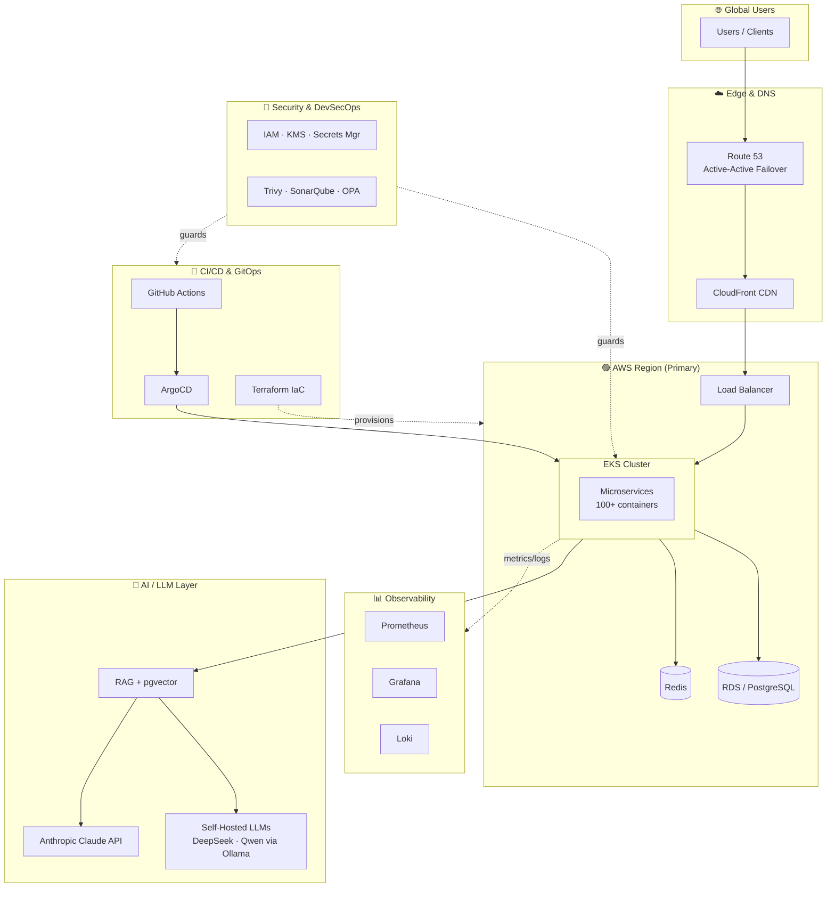

<!--
  GitHub Profile README for AnirudhVaka
  HOW TO USE:
  1. Create a new PUBLIC repo named exactly: AnirudhVaka
  2. Add this file as README.md
  3. Commit. It will render automatically at the top of your profile.
  4. Settings > Profile > enable "Include private contributions on my profile"
     so your activity graph looks active even though work is in private repos.
-->

<h1 align="center">Hi, I'm Anirudh Vaka 👋</h1>

<p align="center">
  <b>Senior DevOps Engineer & DevOps Lead</b><br/>
  I build and operate production cloud infrastructure — and ship AI/LLM systems on top of it.
</p>

<p align="center">
  <a href="https://anirudhvaka.dev"></a>
  <a href="https://linkedin.com/in/anirudhvaka"></a>
  <a href="https://prepatlas.in/engineering"></a>
  <a href="mailto:anirudhvaka@gmail.com"></a>
</p>

---

### 🚀 About Me

I lead DevOps for a **B2B SaaS platform serving 1000+ customers globally**, running production **AWS** and **Kubernetes** at **99.9% uptime**. I'm equally at home architecting multi-region cloud infrastructure, building secure CI/CD pipelines, and self-hosting LLMs on bare metal. On the side, I build and operate **two live AI SaaS products** with paying users.

- 🏗️ **I design for scale & reliability** — multi-region AWS, active-active failover, 200+ CI/CD pipelines
- 🤖 **I ship AI infrastructure** — self-hosted LLMs (DeepSeek, Qwen), RAG with pgvector, Claude integration
- 🔐 **I own security end-to-end** — SOC 2 (Type 1 & 2), SonarQube, OPA/Gatekeeper, container hardening
- 👥 **I lead a team of 5** — setting standards, owning architecture, mentoring on cloud-native practices

---

### 🏛️ How I Architect Systems

A reference architecture in the style of what I build and operate in production:



---

### 🛠️ Tech Stack

**☁️ Cloud & Infrastructure**


**🔄 CI/CD & GitOps**


**📊 Observability**


**🤖 AI / LLM Infrastructure**

-000000?style=flat-square&logo=ollama&logoColor=white)


**🔐 Security & DevSecOps**


**💻 Languages & Data**


---

### 🚢 Things I've Built

| Project | What it is | Stack |
|---------|-----------|-------|
| **[PrepAtlas](https://prepatlas.in)** | AI exam-prep SaaS with grounded RAG — live, paying users. [Engineering writeups →](https://prepatlas.in/engineering) | Next.js · pgvector · Claude · AWS |
| **[HumanifyCV](https://humanifycv.com)** | AI text-humanization SaaS with a custom Claude AI router — live, paying customers | TypeScript · AWS ECS · PostgreSQL |
| **Self-Hosted LLM Platform** | DeepSeek & Qwen on-prem via Ollama — internal chatbot + dev coding assistant | Ollama · On-prem · API layer |

---

### 📈 Highlights

```text
⚡ 99.9% uptime         across hybrid Kubernetes (EKS + on-prem)
🚀 ~60% faster releases via zero-downtime deployments
🛡️ ~70% fewer errors    through automated CI/CD security gates
💰 ~25% cost reduction  via Python automation & right-sizing
📦 200+ pipelines       built across multiple services & environments
🔐 SOC 2 Type 1 & 2     full ownership of controls, evidence, audits
```

---

### 📊 GitHub Activity

<p align="center">
  
  
</p>

---

### 📌 A Note on My Repositories

Most of my work lives in **private company and product repositories** — client infrastructure, SaaS products, and internal tooling — so my public GitHub shows only a fraction of what I build. My **[portfolio](https://anirudhvaka.dev)** and **[engineering writeups](https://prepatlas.in/engineering)** are the best window into how I architect and operate real systems.

<p align="center"><i>Always happy to talk infrastructure, reliability, and AI systems → anirudhvaka@gmail.com</i></p>
